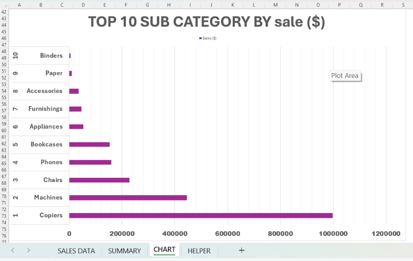

# Superstore Retail Sales Dashboard
## Dashboard Preview

## Project Overview

This project is an interactive Microsoft Excel dashboard created to analyze Superstore retail sales performance.

The dashboard helps users understand:

- Sales Performance
- Profit Analysis
- Category Performance
- Regional Sales
- KPIs
- Business Insights

---

## Dataset

- Dataset: Superstore Sales Dataset
- Tool: Microsoft Excel

---

## Dashboard Features

- Interactive Dashboard
- Pivot Tables
- Pivot Charts
- Slicers
- KPIs
- Dynamic Reports

---

## Skills Demonstrated

- Data Cleaning
- Data Analysis
- Dashboard Design
- Data Visualization
- Excel Formulas
- Pivot Tables
- Business Analytics

---

## Tools Used

- Microsoft Excel

---

## Business Insights

- The Technology category generated the highest sales.
- The West region recorded the strongest sales performance.
- Office Supplies showed lower profit margins than Furniture.
- Interactive slicers allow users to filter data by different dimensions.

## Project Files

- Excel Workbook
- Dataset
- Screenshots

---

## Author
## Connect With Me

**GitHub:** https://github.com/SarthakMishraOfficial

**LinkedIn:** https://www.linkedin.com/in/SarthakMishraOfficial
Sarthak Mishra
